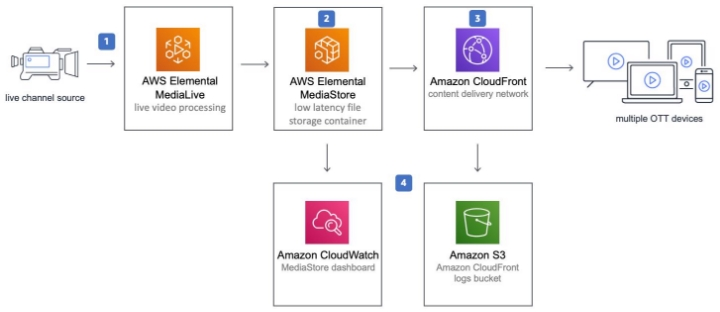

`     `**CSCI 5409** 

`           `**ADVANCE TOPICS IN CLOUD COMPUTING** 

**TICKET BOOKING SYSTEM**

**Final Report** 

**GROUP – 8 ALPHA TEAM** 

DHRUV DOSHI  **[Dh722257@dal.ca** ](mailto:Dh722257@dal.ca)**KISHAN KAHODARIYA  **[Ks805556@dal.ca** ](mailto:Ks805556@dal.ca)**VISHAL RAKESH JAISWAL  **[Vs928999@dal.ca**](mailto:Vs928999@dal.ca)**

**Table of Contents** 

Business Consideration .............................................................................................................3 Final  Architecture ……...............................................................................................................4 

**Business Consideration** 

1. **What would your organization have to purchase to reproduce your architecture in a private cloud while providing relatively the same level of availability as your cloud implementation?** 

In order to replicate our current architecture in a private cloud and achieve the same level of availability and ensure that functionality of the system remains the same, then we would require specific set of standard hardware as mentioned below: 

1. Data storage Server - $5000  
1. Computing hardware - $1000 
1. Network switch - $8,000  
1. System administrator/engineering - $8,000 per year 
1. LAN Connectivity across organization - $12,000 per year 
1. Maintenance Team - $1,00,000 per year 
1. Licensing software  
- GraphQL - $588 per User 
- Stripe – 2.29% per card transaction + $0.30 service charge 
2. **Which cloud mechanism would be most important for you to add monitoring to in order to make sure costs do not escalate out of budget unexpectedly? In other words, which of your cloud mechanisms has the most potential to cost the most money?** 

For our project, the most important cloud service that plays a major role for inner mechanisms are S3 Bucket, CloudFront as our application in deployed on it. Next, is Stripe API, based on which our whole payment module is based, so monitoring it is also required if this service goes down, user won’t be able to place their order and pay for them. Also, the lambda function is an essential service that can be considered as the backend of our system as this service is used to book and make payments for the event. Though these services have their own quota of impact on cost, the service which would require monitoring so that the cost doesn’t escalate is the S3 bucket. Though the most expensive service in our project is EC2 and Dynamodb but we can’t monitor the usage once set. Hence EC2 should be set accordingly and S3 buckets can be updated regularly so that redundant and expired event details are not stored. Moreover DynamoDb has to store the events and cannot be monitored and event data cannot be removed. 

**Final Architecture** 

3. **How do all of the cloud mechanisms fit together to deliver your application?** 

Since all the cloud mechanisms were constructed on one single cloud platform it was relatively easier to fit everything together in a single application. The use of AWS amplify aided to the end to end stitching of all the cloud components together and the integrating of all the components for the successful execution of the application. The application is containerized and deployed on elastic beanstalk over an ec2 compute engine. The DynamoDb stores the orders, events and eventorders. Events table refers to the event details, orders for the complete order details and eventorders the event-wise order details. These details stored in DynamoDb are dynamically stored and fetched during the transactions. 

The userdetails used for signup and login are stored by AWS Cognito and the account are email and phone number verified. 

All the event images and the intermediate data are stored in S3 buckets. Events that are added or deleted by the admin are dynamically updated in the S3 bucket and Dynamodb and then reflected in the frontend. 

API Gateway handled the control of traffic and in making the url open to public access and in the security of the api. 

The AWS Lambda functions were used to process the payments and to complete the order creation by triggering other AWS services and using them effectively.  

For the email services we are supposed to use SNS and SQS but with the help of amplify we were able to automate the mailing services. 

4. **Where is data stored?** 

The event object along with other related information stores in S3 Bucket and also in DynamoDB. The event image files for our system are stored in one of our S3 Bucket. For user credentials, this data is stored within user pool using AWS Cognito. The newly placed order are stored in DynamoDB and when user makes payment, then that transaction is stored using Stripe API and it gets reflected within organization’s account. Additionally, it can be said that S3 stores the image files of events in one bucket and intermediate transaction details in the other bucket. The DynamoDB stores data orders, events and eventorders in key value pairs. Events table refers to the event details, orders for the complete order details and eventorders the event-wise order details. AWS Cognito stores user data in userpool where the registration data is stored for the user. Moreover the order details also contains which user has ordered what event and more. 

5. **What programming languages did you use (and why) and what parts of your application required code?** 

For most part of our system, we have used React.js to write the code as its very responsive and its very compatible with most of other AWS services that our system is using. Both our lambda functions required code to fetch or pass on data from the frontend to backend and vice versa. Overall, the pages are build using Reactjs and designed using “uuid” package. The backend and lambda functions are written in node.js. The code repository can be found using the link  https://github.com/DhruvDoshi/cloudproject. Moreover the complete front end was written in reactjs whereas the lambda functions and the api calls were written in Node.js. These programming node+react framework were used as the team was familiar with it and AWS services support Node environment. 

6. **If your final architecture differs from your original project proposal, explain why that is. What did you learn that made you change technologies or approaches?** 

The final architecture is almost the same as described in the proposal, this is because the study and research that was done during the proposal was done considering the alternatives and the actual flow of the application. However we do not used RDS and used only DynamoDb to store data in key value pairs. This was done to reduce dependency and use of a single service to perform the tasks.The Secret Manager Service was also not used as the authentication and authorization alongwith password management was handled by AWS Cognito itself. 

We learnt that RDS was not required if we do not use a RDBMS but added it to the proposal as we were not sure during proposal that how we would store the data.  

Since the auth tokens were handled by Cognito and Amplify and AWS Secret Manager was to be used only for this purpose we didn’t use Secret Manager. 

Moreover the payment gateway is implemented using Stripe which was not decided during the proposal. 

7. **How would your application evolve if you were to continue development? What features might you add next and which cloud mechanisms would you use to implement those features?** 

If the application was to evolve further we would try implementing it wit some of the services of Google Cloud platform to improvise the performance and efficiency of the system. Some new features such as online streaming of the events can also be added using AWS Elemental Mediastore and AWS Elemental MediaLive mechanisms. This could be integrated in our system and users could also view the live events for the tickers they purchased. 

However, this implementation is not possible with AWS Academy Student edition. The CloudFront would be used as a Content Delivery Network and logs would be stored in S3 bucket. The MediaStore logs could be seen using CloudWatch. Below is the working of the mechanisms together as an add on to our application. 

Image Source:[https://aws.amazon.com/solutions/implementations/live-streaming-on-aws/ ](https://aws.amazon.com/solutions/implementations/live-streaming-on-aws/)

Moving ahead we would like to change the UI completely as because of the time constraints we were not able to build a user centric and good looking user interface. Alongside that, there is need to determine the type of access from the login module. Like for the admin they need to access the page from the URL which is not viable solution for the longer run hence for future projection we would like to have a direct access page for the admin to access the add event page by default using their ID and PASSWORD.  There is another domain to be unlocked by allowing user to post the events, like event bribe and bookmyshow, they allows users to add the events and other users could book the event. The major challenges to develop this type of flow would be that for the user who is selling the ticket the payment models should be configured in that way and there are some laws which should be taken care of and proper KYC of the user is also needed that they are not fraud and there are events like that happening. 

**References:** 

1) <https://docs.aws.amazon.com/>
1) https://www.freecodecamp.org/
